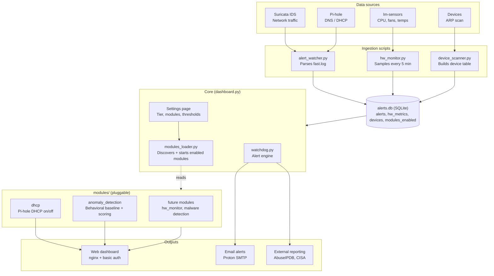
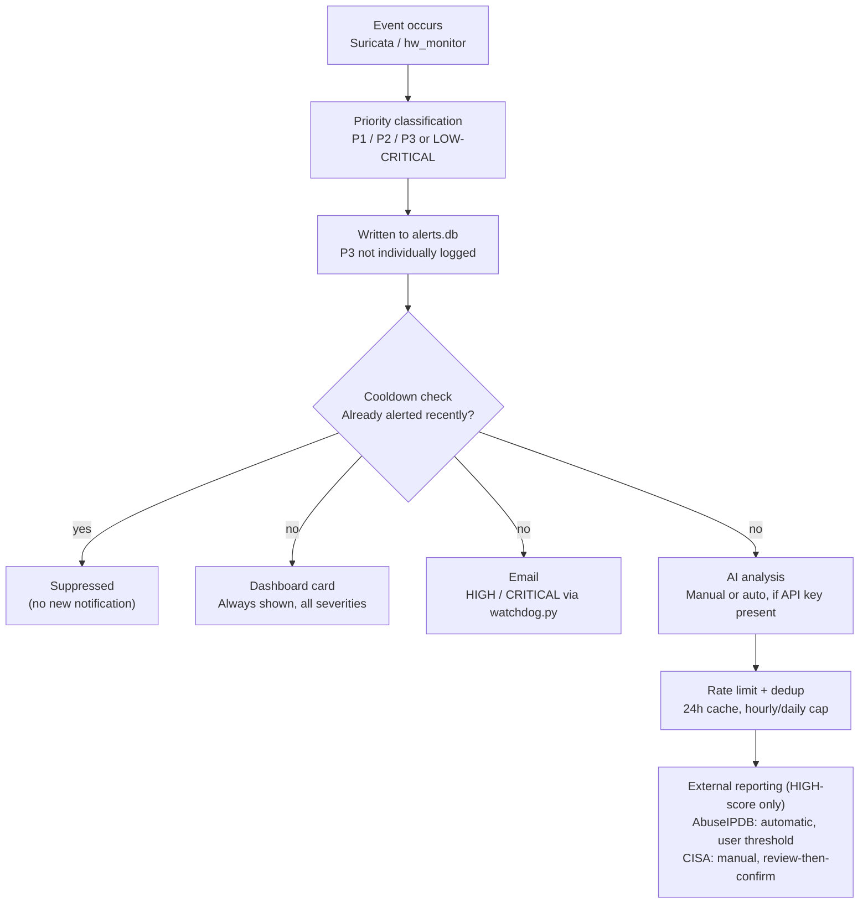

# Nemesis Firewall — Architecture

This document gives a high-level map of how Nemesis Firewall is put together, for anyone (including future-you) extending or auditing the project.

## High-level architecture

## Alert data flow

## Notes

- **Module architecture**: every feature beyond the core firewall stack (DHCP takeover, zero-day/anomaly detection, and eventually hardware monitoring) is built as a self-contained module under `modules/<name>/`, each with a `manifest.json` and a Python file implementing `start()`, `stop()`, `status()`, `get_dashboard_card()`, and `get_routes()`. Modules are independently enabled/disabled from the Settings page with zero changes required to `dashboard.py`.
- **3-tier explanation system**: all client-facing text (alert descriptions, tooltips, labels) can render at Beginner / Intermediate / Pro detail levels, controlled by a per-browser setting. Raw data (IPs, temperatures, timestamps) is never tiered — only explanatory copy.
- **P3 alerts** (informational/routine Suricata traffic) are counted in dashboard totals but not individually written to the `alerts` table, since they're high-volume and low-value to log individually.
