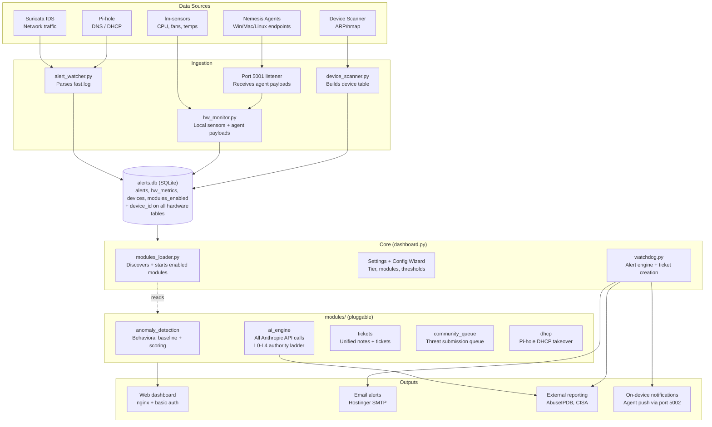
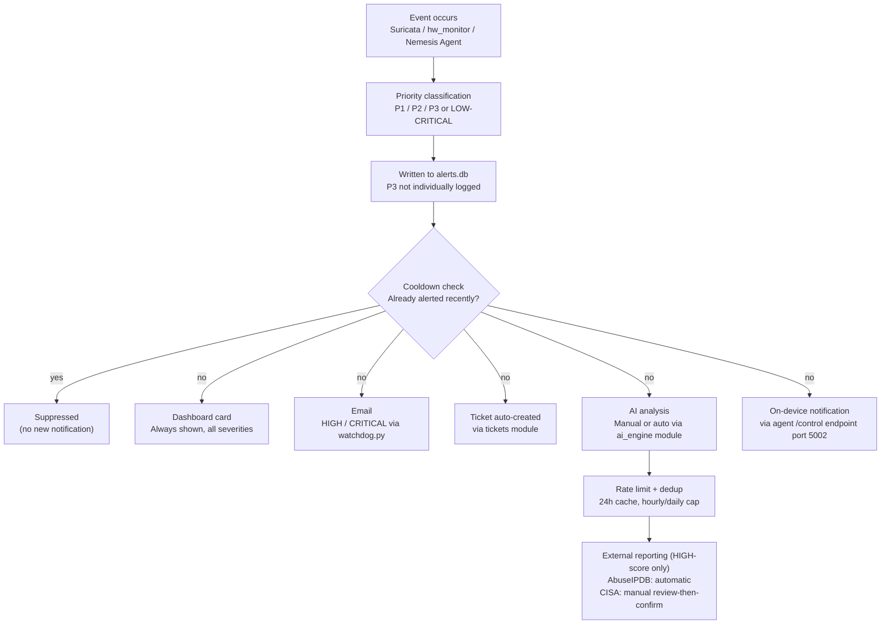
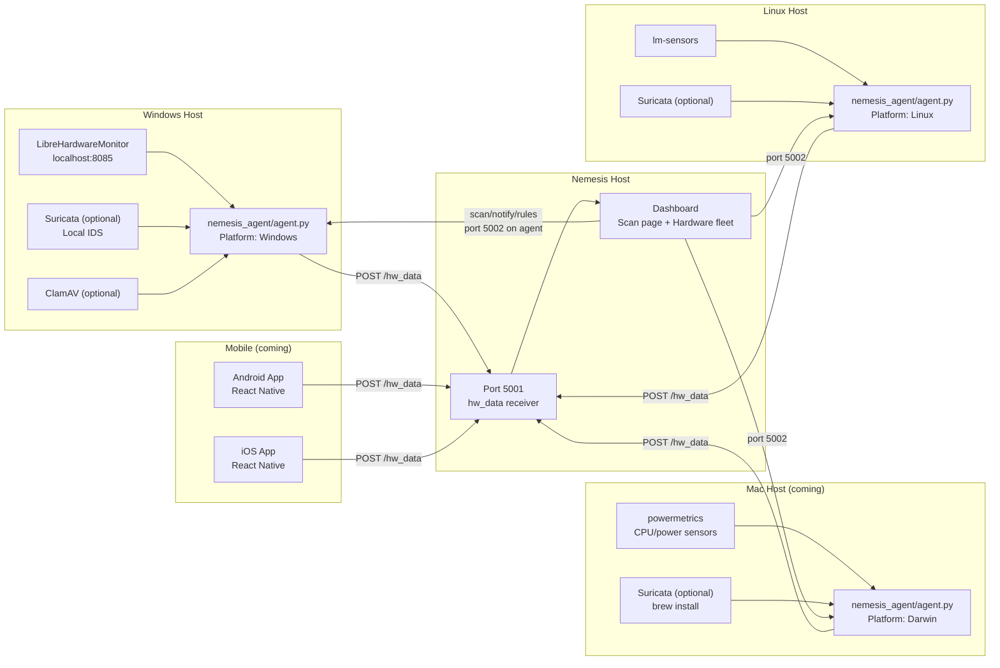

# Nemesis Firewall — Architecture

This document gives a high-level map of how Nemesis Firewall is put together, for anyone extending or auditing the project.

## Product principle — minimize per-install / per-account manual setup

**Minimize per-install and per-account manual setup friction wherever technically possible.
The more Nemesis detects and configures for itself rather than asking a user to enter by
hand, the stronger the product feels to a real person.** Named anti-pattern: legacy antivirus
with a separate license key and a full setup ritual per machine — a household deploying
Nemesis across several devices and accounts should not experience one setup ceremony per
device or account. This directly motivated ADR 0028's D11.2 (enroll a terminal inbox once,
not every forwarding address) and D12 (agent-assisted account discovery instead of typing).

**"Wherever technically possible" is load-bearing — this principle must never be invoked to
weaken a security boundary.** There are two kinds of friction and they are not
interchangeable:

| | example | verdict |
|---|---|---|
| **Artificial friction** | a license key per machine; re-entering an address the device already knows | Remove it — this is what the principle targets |
| **Intrinsic friction** | an app-password step the account owner must complete; consent before scanning a device | Keep it — it exists because a security or consent model requires it |

The principle is satisfied by making an unavoidable step smooth, guided and unmistakable —
never by removing the step itself. Stated here, ahead of design work, because "reduce setup
friction" is exactly the kind of principle a future reader could invoke, in good faith, to
justify the wrong change.

## High-level Architecture



## Alert Data Flow



## Nemesis Agent Architecture

The unified Nemesis Agent runs on Windows, Mac, and Linux endpoint devices. One codebase, self-detects platform.



### Agent Payload

```json
{
  "source": "nemesis_agent",
  "device_id": "persistent-uuid",
  "device_name": "Paul's Laptop",
  "device_type": "windows|mac|linux|android|ios",
  "connection_type": "local|vpn_remote",
  "hardware": { "cpu_temp": {}, "fan1": {}, "cpu_pct": {}, "ram_mb": {} },
  "security": { "top_processes": [], "network_connections": [], "usb_events": [] },
  "agent_health": { "suricata_running": false, "last_scan_result": "clean" },
  "suricata_alerts": [],
  "scan_result": null
}
```

### VPN / Remote Worker Support

Agent detects local vs VPN by comparing its IP against configured `nemesis_subnet`. When remote:
- Shows "Remote (VPN)" badge in dashboard
- Switches local Suricata to roaming profile (high-confidence rules only)
- All telemetry and scan triggers work through the VPN tunnel

### Local Suricata IDS (Optional per device)

Inspects traffic before VPN encryption — solves split-tunnel visibility gap.
- **Office profile** — full rule set, used on local network
- **Roaming profile** — high-confidence subset, used on VPN/public WiFi
- Auto-switches on connection type change
- Rules served by Nemesis host at `GET /api/agent/rules?profile=office|roaming`

---

## Module Architecture

Each module in `modules/<name>/` implements:

```
modules/<name>/
├── manifest.json    — name, description, version, enabled
└── module.py        — start(), stop(), status(), get_dashboard_card(), get_routes()
```

Modules own their routes, own their databases, and can be toggled without affecting core.

**Current modules:** anomaly_detection, ai_engine, tickets, community_queue, dhcp

---

## Key Notes

- **3-tier system:** all user text has Beginner/Intermediate/Pro variants via `tierText()`
- **device_id** on `hw_metrics` enables multi-device hardware monitoring (`'local'` = Nemesis host)
- **Port 5001** — Nemesis listens for agent payloads
- **Port 5002** — each agent listens for commands (scan, notify, rule updates)
- **AI authority — the L0–L4 ladder** (see below). Replaces the earlier "Teaching Mode /
  Automated Mode with LOW/MEDIUM/HIGH approval" description, which never existed in code
- **JS in Python f-strings** — always use single quotes for JS or `json.dumps()`. English contractions (it's, machine's) must use `&#39;` — this has caused multiple bugs

---

## AI authority — the L0–L4 ladder

**This is the real approval model.** It supersedes the "Teaching Mode / Automated Mode"
note that stood here until 2026-08-21. Being precise about what was and was not true of
that note, because the difference matters:

- **"Teaching Mode" describes something real**, under a name the code does not use. The
  chat system prompt instructs the assistant to name the read-only commands that would
  answer a question and explain how to read the output, under a hard rule — *"ONLY EVER
  SUGGEST COMMANDS THAT READ STATE."* That behaviour exists and is worth keeping; only the
  label was fictional.
- **"Automated Mode" describes nothing.** No code path executes an AI-chosen action, and
  the `LOW=click OK / MEDIUM=confirm / HIGH=type YES` vocabulary appears nowhere in the
  tree (`teaching_mode`, `automated_mode`, `auto_execute`: zero hits).

What shipped instead is a per-capability ladder, and it is the stronger model: authority
attaches to a **class of action**, not to how emphatically the user is asked. "Type YES"
is a prompt style; a ceiling is a permission.

Defined in `modules/ai_engine/module.py` (`L0_OBSERVE`–`L4_GOVERN`):

| Level | Name | What the AI may do |
|---|---|---|
| 0 | `L0_OBSERVE` | Explain a finding and how to investigate it. Read-only commands may be suggested; no changes recommended, no action offered. |
| 1 | `L1_RECOMMEND` | Recommend a specific action with reasoning. Cannot execute — every recommendation is a proposal a human approves. |
| 2 | `L2_ACT_REVERSIBLE` | May offer to carry out a **reversible** action, through the system's gated action path, after explicit confirmation. |
| 3 | `L3_ACT_DISRUPTIVE` | As above, for actions with real disruption potential. |
| 4 | `L4_GOVERN` | **Ceilinged, not granted.** May act **unattended**, on its own judgment, where the action is disclosed and reversible. One class may reach L4 (see below); nothing holds it today, because a hard ceiling permits a level without conferring one. |

**Authority is per action class, not global** (`ACTION_CLASS_CEILINGS`): e.g.
`ip_quarantine_external` ceilings at L3, `ip_block_permanent` at L2, and both
`ip_action_internal` and `malware_file_quarantine` are pinned at L1 — the AI may recommend
quarantining a file, never do it. Setting an alert's disposition (`alert_disposition`)
ceilings at L2, because a disposition is reversible. The firewall lockout failsafe's
override (`firewall_failsafe_override`) ceilings at L4, the only class that does — reachable
at no lower earned level and narrowable further by a standing rule. ADR 0019 records the
disclosure guarantee that makes it safe: the override does not take effect unless a log entry,
a ticket and an email have all been created first, and fails closed if any of them cannot be.

**The effective level is `min()` of three terms** (`effective_ceiling()`): what has been
*earned* (`ai_authority.current_level`), the *hard* code-level ceiling for that class, and
any *user standing rule*. Standing rules **narrow only** — there is deliberately no rule
type that raises a term, so no wording of a rule can widen authority. That is a structural
guarantee, not a matter of the model interpreting an instruction conservatively.

⚠ **Current state (2026-08-21): the ladder is INERT.** `ai_authority`, `ai_proposals` and
`ai_standing_rules` exist as schema with **no production writer**, so `earned` resolves to
L0 on every install and `effective_ceiling()` returns 0 for every class. In practice the AI
is explain-only everywhere, and today it gates only what the chat may *say* — no execution
path consults it, because nothing executes. Wiring L1 (propose + approve/reject) is the
next step; see the scoping note in the private mirror.

✅ **Reconciled 2026-08-21.** The alert-verdict path (`/api/analyze/<rule_id>`) used
to write `alerts.action` without consulting `effective_ceiling()` at all, while chat on the
same alert was fully gated — two surfaces, one object, opposite permission models. It now
goes through the `alert_disposition` class:

| effective level | what happens to the alert |
|---|---|
| L0 | stays `pending`; a human decides. The engine explains only. |
| L1 | the engine PROPOSES a disposition (recorded in `ai_proposals` for approval) |
| L2 | the engine may set the disposition itself (reversible, and undoable) |

Because nothing writes `ai_authority` yet, every install resolves to L0 today — so the
practical effect of the fix is that the engine STOPPED auto-ignoring low-risk alerts until
authority is actually granted. That is the correct direction: the permission model is now
true rather than decorative.
