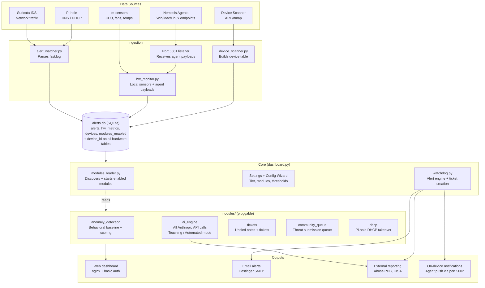
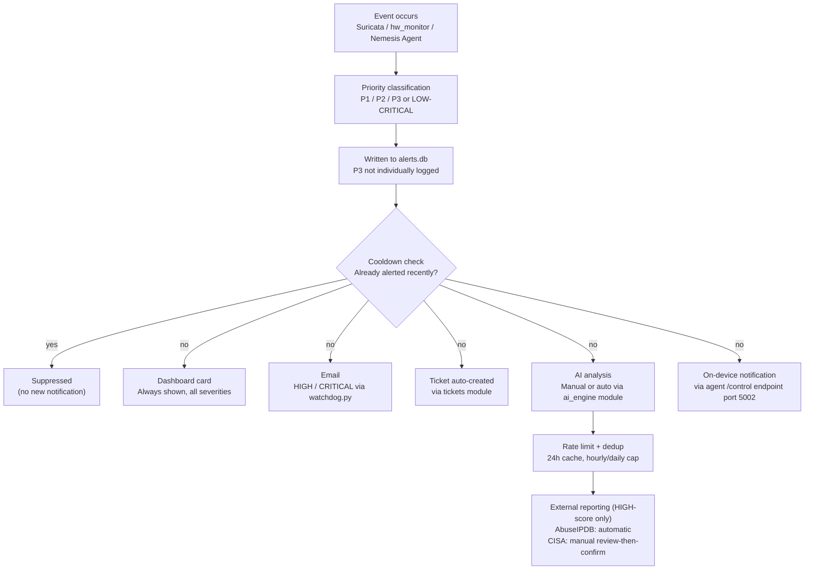
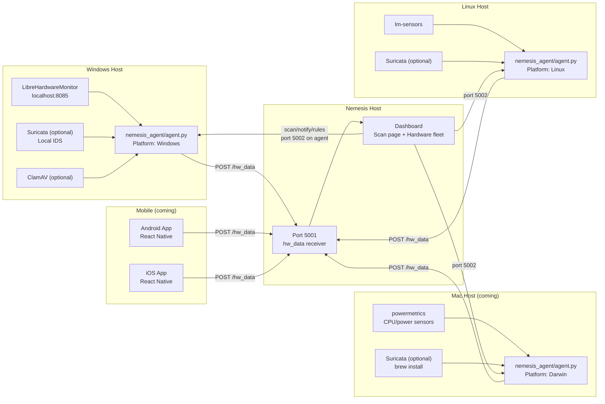

# Nemesis Firewall — Architecture

This document gives a high-level map of how Nemesis Firewall is put together, for anyone extending or auditing the project.

## High-level Architecture



## Alert Data Flow



## Nemesis Agent Architecture

The unified Nemesis Agent runs on Windows, Mac, and Linux endpoint devices. One codebase, self-detects platform.



### Agent Payload

```json
{
  "source": "nemesis_agent",
  "device_id": "persistent-uuid",
  "device_name": "Paul's Laptop",
  "device_type": "windows|mac|linux|android|ios",
  "connection_type": "local|vpn_remote",
  "hardware": { "cpu_temp": {}, "fan1": {}, "cpu_pct": {}, "ram_mb": {} },
  "security": { "top_processes": [], "network_connections": [], "usb_events": [] },
  "agent_health": { "suricata_running": false, "last_scan_result": "clean" },
  "suricata_alerts": [],
  "scan_result": null
}
```

### VPN / Remote Worker Support

Agent detects local vs VPN by comparing its IP against configured `nemesis_subnet`. When remote:
- Shows "Remote (VPN)" badge in dashboard
- Switches local Suricata to roaming profile (high-confidence rules only)
- All telemetry and scan triggers work through the VPN tunnel

### Local Suricata IDS (Optional per device)

Inspects traffic before VPN encryption — solves split-tunnel visibility gap.
- **Office profile** — full rule set, used on local network
- **Roaming profile** — high-confidence subset, used on VPN/public WiFi
- Auto-switches on connection type change
- Rules served by Nemesis host at `GET /api/agent/rules?profile=office|roaming`

---

## Module Architecture

Each module in `modules/<name>/` implements:

```
modules/<name>/
├── manifest.json    — name, description, version, enabled
└── module.py        — start(), stop(), status(), get_dashboard_card(), get_routes()
```

Modules own their routes, own their databases, and can be toggled without affecting core.

**Current modules:** anomaly_detection, ai_engine, tickets, community_queue, dhcp

---

## Key Notes

- **3-tier system:** all user text has Beginner/Intermediate/Pro variants via `tierText()`
- **device_id** on `hw_metrics` enables multi-device hardware monitoring (`'local'` = Nemesis host)
- **Port 5001** — Nemesis listens for agent payloads
- **Port 5002** — each agent listens for commands (scan, notify, rule updates)
- **Teaching Mode** — AI shows copyable commands, user runs them in their own terminal
- **Automated Mode** — AI executes with tiered approval (LOW=click OK, MEDIUM=confirm, HIGH=type YES)
- **JS in Python f-strings** — always use single quotes for JS or `json.dumps()`. English contractions (it's, machine's) must use `&#39;` — this has caused multiple bugs
